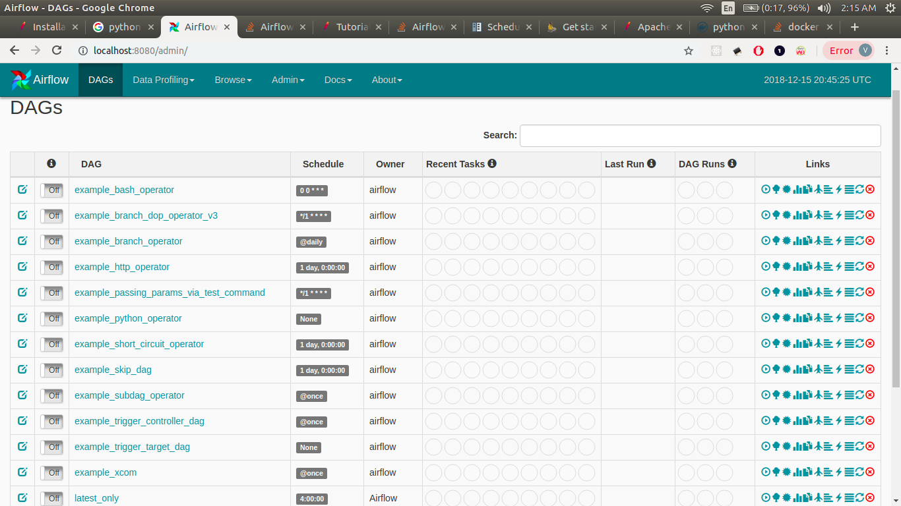
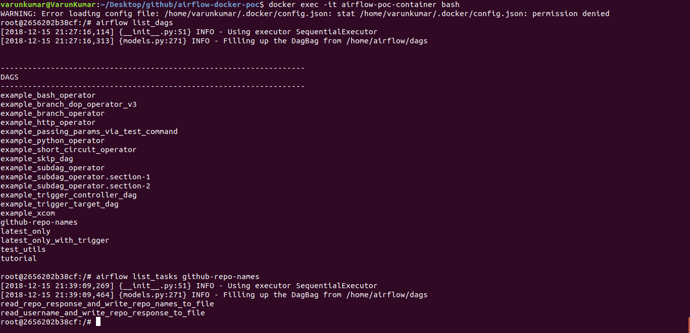
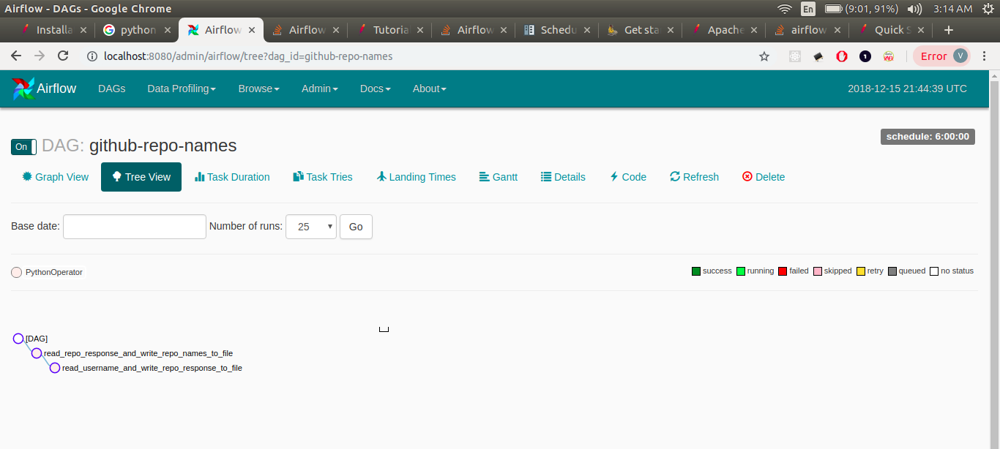
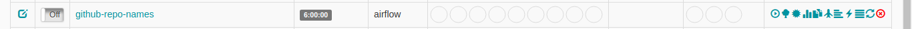

## Apache airflow PoC using docker

#### What is Airflow?

Apache Airflow is open source platform to to programmatically author, schedule and monitor workflows.
Originally developed by Airbnb, it is undergoing incubation at Apache Software Foundation.

#### Sample use cases

1. Daily backup of your database e.g. from production to Amazon S3
2. Schedule interdependent tasks e.g. data processing pipelines in big data

#### What are we going to achieve

As a proof of concept, we'll install Airflow in a docker container and run a simple job.
Our job will consists of two tasks-

1. Task1: This will read github username from a file, get repositories details of that username using github api and write response to another file.
2. Task2: This will read response from file (written by task1), parse it and write name of all repositories in a new file.
3. Clearly task2 is dependent on task1 and must be performed only after execution of task1
4. We'll schedule this job at a regular interval of 6 hours.

#### Steps to build airflow docker image

1. Clone this repository `git clone https://github.com/varunon9/airflow-poc-using-docker`
2. Move to repository `cd airflow-poc-using-docker`
3. Build the image `docker build -t airflow-poc .` airflow-poc will be name of image
4. Check newly built image using `docker images`
5. Create a dedicated directory for airflow inside home directory `mkdir -p ~/airflow/dags/`
6. Run airflow-poc image as container
    ```
    docker run  -d \
    -e AIRFLOW_HOME=/home/airflow \
    --publish 8080:8080 \
    --volume=/home/varunkumar/airflow:/home/airflow \
    --name=airflow-poc-container airflow-poc
    ```
7. With above command we started our container in detach mode `-d` and mapped host(your machine) port 8080 with container port 8080 (airflow web server) `--publish 8080:8080`.
Airflow needs a home which we are passing using AIRFLOW_HOME environment variable.
We are also setting a bindmount volume that links airflow home (/home/airflow) directory inside container to airflow home directory on the host machine. We are naming our container as airflow-poc-container. Change host home directory path according to your machine (one created in step 5).

8. Check logs to see if everything went smooth. `docker logs airflow-poc-container`
9. Check the container state `docker ps`. If it's successful then visit localhost:8080 from your browser
10. You'll see the admin dashboard of Airflow DAGs

###$ Airflow Admin screen on visiting localhost:8080



#### Time to run our job which is actually a DAG (Directed Acyclic Graph)

1. Lets copy our sample dag file to airflow home directory `cp github-repo-names-dag.py ~/airflow/dags/`
2. As soon as we copy this file, a new DAG is created inside Airflow. You can refresh airflow admin screen to confirm it. (It might take few seconds)
3. Another way to confirm this is using airflow command line but you will have to go inside container to use this.
4. Go inside container `docker exec -it airflow-poc-container bash`
5. List all DAGs `airflow list_dags` You will see github-repo-names which we created just now
6. `airflow list_tasks github-repo-names` will list tasks of our DAG



7. You can also inspect this DAG from dashboard by clicking on it.



8. Edit username.txt file with your own github username and copy this to `~/airflow` directory
9. `cp username.txt ~/airflow/` Since we have setup bindmount to `~/airflow` directory with `/home/airflow` directory inside container, username.txt will now be accessible from docker container.
10. Lets now trigger our DAG from Airflow admin dashboard. To do so, first activate this dag by clicking on switch icon (left side off/on toggle button), and then click on trigger-dag button (right side 1st option).



11. If you are not able to see activate/toggle button then just stop container and start again. `docker stop airflow-poc-container` and `docker start airflow-poc-container`
12. You will see that as soon as task is executed, two files will be created inside `~/airflow` directory- `repo-names.txt` and `repos.txt`. `repo-names.txt` is final outcome which we are interested in.
13. You can check progress, logs and a lot of other details from dashboard itself.
14. To create a new DAG, just copy corresponding python file inside `~/airflow/dags` directory and repeat above steps. As a tip, if you are modifying existing DAG then keep changing id e.g. `github-repo-names_v1`, `github-repo-names_v2` etc


#### Queries/Comments

You can contact me at varunon9@gmail.com or create github issues.